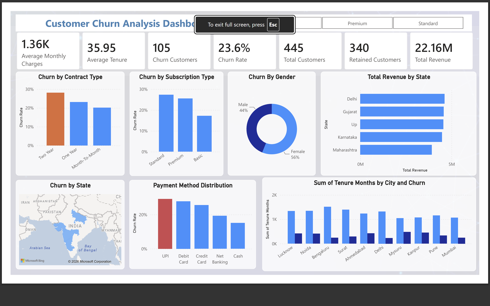

# 📊 Customer Churn Analysis

## 📌 Project Overview

Customer churn is a critical business problem because losing customers can directly impact revenue and long-term growth.

This project analyzes customer data to identify churn patterns, understand the characteristics of customers who are more likely to churn, and generate insights that can support customer retention strategies.

The project includes the complete analytics workflow, from data cleaning and preparation to analysis and dashboard development in Power BI.

## 🎯 Business Objectives

- Analyze the overall customer churn rate.
- Identify churned and retained customers.
- Analyze churn across different customer segments.
- Understand churn by contract and subscription type.
- Analyze churn by payment method and geography.
- Analyze customer tenure and monthly charges.
- Measure revenue contribution across customer segments.
- Generate actionable retention recommendations.

## 🛠️ Tools Used

- **Power BI** – Dashboard development, data analysis, and visualization.
- **Excel** – Data cleaning, validation, and preparation.
- **DAX** – KPI and measure calculations.

## 📂 Dataset

The cleaned dataset contains **492 customer records and 18 columns**.

### Key Columns

| Column | Description |
|---|---|
| Customer_ID | Unique identifier for each customer |
| Customer_Name | Customer name |
| Gender | Customer gender |
| Age | Customer age |
| State | Customer state |
| City | Customer city |
| Tenure_Months | Customer tenure in months |
| Subscription_Type | Customer subscription plan |
| Monthly_Charges | Monthly amount charged to the customer |
| Total_Charges | Total charges generated by the customer |
| Contract_Type | Type of customer contract |
| Payment_Method | Customer payment method |
| Internet_Service | Type of internet service |
| Tech_Support | Whether the customer receives technical support |
| Senior_Citizen | Senior citizen indicator |
| Dependents | Whether the customer has dependents |
| Churn | Customer churn status |
| Last_Interaction_Date | Most recent customer interaction date |

## 📈 Key Performance Indicators

- Total Customers
- Churned Customers
- Retained Customers
- Churn Rate
- Average Monthly Charges
- Average Customer Tenure
- Total Revenue

## 📊 Dashboard Analysis

The Power BI dashboard analyzes:

- **Churn by Contract Type**
- **Churn by Subscription Type**
- **Churn by Gender**
- **Revenue by State**
- **Churn Rate by Payment Method**

## 🔍 Key Insights

The analysis investigated churn across contract type, subscription type, payment method, tenure, monthly charges, geography, and customer demographics.

One observation was that customers using **UPI as a payment method showed an observed churn rate of approximately 29.2%** in the analyzed dataset.

> **Important:** This does not mean UPI causes churn. Further analysis would be required to investigate factors such as failed transactions, customer complaints, tenure, subscription type, and monthly charges before establishing causation.

## 💡 Business Recommendations

### 1. Target High-Risk Customer Segments
Develop targeted retention campaigns for customer groups with higher observed churn.

### 2. Investigate Payment-Related Issues
Analyze failed transactions, payment complaints, and customer experience across payment methods.

### 3. Develop Segment-Specific Retention Strategies
Use contract type, subscription type, tenure, monthly charges, and location to personalize retention offers.

### 4. Monitor Customer Behavior
Track customer interactions and engagement to identify potential churn risks earlier.

### 5. Combine Churn Data with Customer Feedback
Integrate complaints, CSAT, and interaction data to better understand root causes of churn.

## 🔄 Project Workflow

```text
Raw Dataset
     ↓
Data Cleaning
     ↓
Data Validation
     ↓
Data Analysis
     ↓
KPI Creation using DAX
     ↓
Power BI Dashboard Development
     ↓
Business Insights
     ↓
Recommendations
```

## 📁 Project Files

- `Customer Churn Dashboard.pbix` — Power BI dashboard
- `Clean_churn_Data.xlsx` — final cleaned dataset
- `Churn Dataset Cleaning.pdf` — data cleaning documentation
- `Complete Project Flow.docx` — project workflow/documentation
- `Bg62.png` — dashboard preview
- `README.md` — project documentation

## 📷 Dashboard Preview



## 🚀 Skills Demonstrated

**Power BI | DAX | Excel | Data Cleaning | Data Analysis | Data Visualization | KPI Development | Customer Churn Analysis | Business Analysis | Customer Segmentation**

## 👨‍💻 About Me

I am a Data Analyst with hands-on experience working with **SQL, Python, Excel, and Power BI**.

I enjoy transforming raw data into meaningful insights and creating interactive dashboards that support data-driven business decisions.
